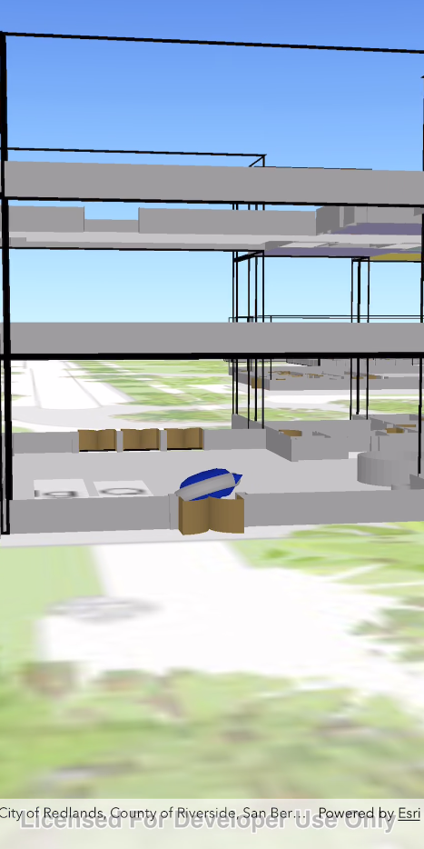

This is an example of Navisens' SDK integration with ArcGIS' 3D Visuals SDK.

Then retrieve a Navisens SDK key [here](https://navisens.com/).  
And add it to the `runMotionDna` method in the `DisplayLocationViewController.swift` file.

When you are done with all your key retrievals, run:
```
pod install // Will install latest MotionDna SDK and ArcGIS SDK version 100.3
open arcgis-3d-world.xcworkspace // Will launch xcode
```

After completing the setup, you'll be able to see the Navisens location in 3D starting from Esri's HQ
in Redlands.

How it works:

I start you off initially at the coordinates 34.055920, -117.195647 (lat/lon) with the heading facing
North. Which corresponds to you facing the main Esri campus entrance. As you start the application
ensure you are at these coordinates and you are facing North.

If you want to test it around campus, just run setLocationNavisens instead of 
setLocationLatitudeLongitudeAndHeadingInDegrees(), which will be a much more general purpose
positioning system.

What'll be cool is you will be able to see the elevation and what floor you are being located at.

Have fun!

